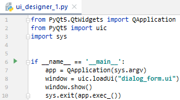
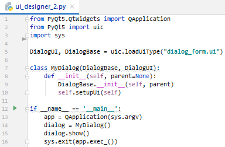
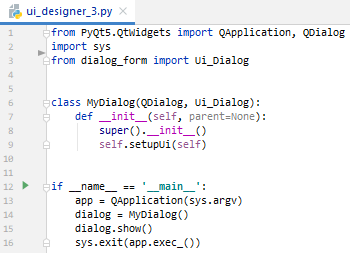
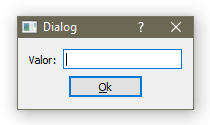

# Hello World
Mínimas porciones funcionales de código
## HW1
API SQLite de Python

API SQLite de PyQt5
## HW2
Ventana vacía PyQt5

Ventana vacía PyQt5 usando clases
## HW3
Diálogo creado con Qt Designer

Importado de 3 formas distintas:

  - uic.loadUi()

    
  - uic.loadUiType()
  
    
  - convertido mediante pyuic5

     

En los tres casos el resultado es el mismo:

